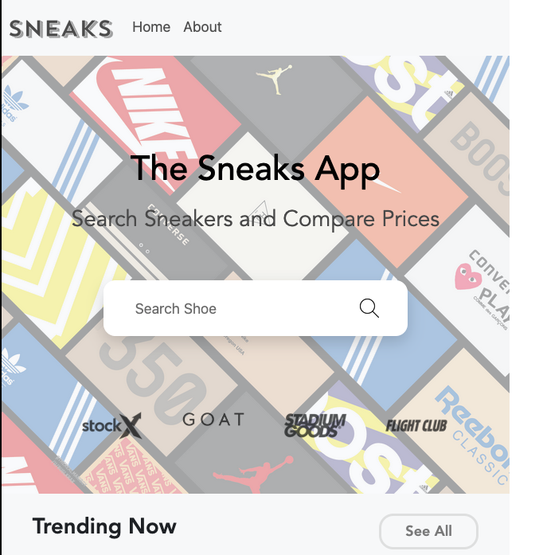

# The Sneaks App


## Overview

The Sneaks App is a modern web application that allows users to search for sneakers and compare prices across various reselling platforms. Built with React and leveraging modern web technologies, this application provides sneaker enthusiasts with a seamless way to find and compare prices for their favorite footwear.

## Features

- **Sneaker Search**: Search for any sneaker by name, brand, or style ID
- **Price Comparison**: Compare prices across major reselling platforms including StockX, GOAT, Flight Club, and Stadium Goods
- **Trending Sneakers**: View currently trending sneakers in the marketplace
- **Brand Filtering**: Filter sneakers by popular brands
- **Responsive Design**: Optimized for both desktop and mobile viewing
- **Detailed Product Information**: View comprehensive details including colorway, style ID, release date, and retail price

## Technology Stack

### Frontend
- **React**: A JavaScript library for building user interfaces
- **React Router**: For handling navigation within the application
- **React Bootstrap**: UI components based on the Bootstrap framework
- **Vite**: A modern frontend build tool that significantly improves the development experience

### Testing
- **Jest**: JavaScript testing framework
- **React Testing Library**: For testing React components
- **Jest Fetch Mock**: For mocking API calls during testing

### API
- Custom sneaker price API hosted on Replit (https://shoepriceapi.replit.app/)

## Project Structure

```
├── public/                # Public assets
├── src/                   # Source files
│   ├── components/        # React components
│   │   ├── BrandIcons.jsx # Brand filtering interface
│   │   ├── ErrorBoundary.jsx # Error handling component
│   │   ├── MiniCard.jsx   # Sneaker card component
│   │   ├── NavBar.jsx     # Navigation bar
│   │   ├── ProductCard.jsx # Detailed product view
│   │   ├── Products.jsx   # Search results display
│   │   ├── SearchBar.jsx  # Search functionality
│   │   └── Trending.jsx   # Trending sneakers display
│   ├── images/            # Image assets
│   ├── App.css            # Application styling
│   ├── App.jsx            # Main application component
│   ├── index.css          # Global styles
│   └── index.jsx          # Application entry point
├── __mocks__/             # Jest mock files
├── .babelrc               # Babel configuration
├── jest.config.cjs        # Jest configuration
├── package.json           # Project dependencies
├── tsconfig.json          # TypeScript configuration
└── vite.config.js         # Vite configuration
```

## Implementation Details

### API Integration
The application communicates with a custom API that aggregates sneaker data and prices from various sources. The API endpoints include:
- Trending sneakers
- Search by keyword
- Product details by style ID
- Price comparison across platforms

### Routing
React Router is used to handle navigation between different views:
- Home page with trending sneakers (`/`)
- Search results page (`/search/:key`)

### Error Handling
The application implements error boundaries to gracefully handle runtime errors without crashing the entire application.

### Component Architecture
- **App**: The root component that sets up routing and the main layout
- **NavBar**: Application header with navigation controls
- **SearchBar**: Search input for finding sneakers
- **BrandIcons**: Quick access to popular sneaker brands
- **Trending**: Display of currently trending sneakers
- **Products**: Search results display with filtering options
- **MiniCard**: Condensed sneaker information card
- **ProductCard**: Detailed sneaker information with price comparison

### State Management
The application uses React's built-in state management features:
- `useState` for component-level state
- `useEffect` for side effects like API calls
- Props for passing data between components

### Testing
The application includes a suite of tests to ensure functionality:
- Component rendering tests
- API interaction tests
- User interaction simulations

## Development Setup

### Prerequisites
- Node.js (version 14 or higher)

### Installation

1. Clone the repository from Replit
2. Install dependencies:
   ```
   npm install
   ```

### Running the Development Server
```
npm run dev
```
The application will be available at `http://localhost:5173` or the port specified by your Replit environment.

### Building for Production
```
npm run build
```
This creates an optimized build in the `dist` directory.

### Running Tests
```
npm test
```

## Deployment

The application is configured for deployment on Replit with the following settings in `.replit`:
```
deploymentTarget = "static"
build = ["npm", "run", "build"]
publicDir = "dist"
```

## Future Enhancements

- User accounts for saving favorite sneakers
- Price alerts when sneakers drop below a specified price
- Historical price data visualization
- Expanded filtering options (size, condition, etc.)
- Mobile application version

## Contributing

This project is open for contributions. To contribute:

1. Fork the project on Replit
2. Create a feature branch
3. Submit a pull request with a detailed description of your changes

## License

ISC License - See package.json for details

## Acknowledgments

- React and Vite teams for their excellent development tools
- Bootstrap for the responsive design framework
- Sneaker reselling platforms for inspiration
